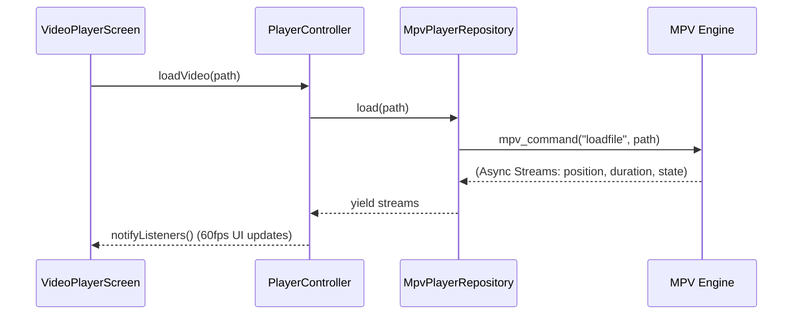

# 🏗️ MPx Player - Architecture & Technical Design Document

This document serves as the comprehensive, authoritative source for understanding the architecture, design patterns, data flows, and technical decisions behind MPx Player. It is intended for core maintainers and contributors.

---

## 🧭 1. Architectural Philosophy

MPx Player is built upon a strict **Feature-First Clean Architecture**. This approach ensures that the app is scalable, highly testable, and maintainable. 

### Core Tenets:
1. **Decoupled Layers:** UI code knows nothing about SQLite or video engines. Data code knows nothing about Flutter Widgets.
2. **Feature Encapsulation:** Code is grouped by what it *does* (e.g., `player`, `library`), not by what it *is* (e.g., all controllers in one folder).
3. **Offline-First Resilience:** The app assumes no network connectivity exists. All operations fail gracefully or rely on local caching.
4. **Reactive State:** The UI is a pure function of state, driven by streams and `ChangeNotifier`s.

---

## 📂 2. Directory Structure & Feature Modules

The codebase is housed entirely in the `lib/` directory.

```text
lib/
├── core/                               # App-wide shared infrastructure
│   ├── database/                       # SQLite config, migrations, DB helper
│   ├── errors/                         # Failure classes, Exceptions
│   ├── services/                       # Singleton services (Logger, Permissions)
│   ├── theme/                          # Colors, Typography, AppThemeTokens
│   ├── utils/                          # Constants, Extensions, formatters
│   └── widgets/                        # Dumb, reusable UI components
│
├── features/                           # Independent feature modules
│   ├── library/                        # Core file browsing and indexing
│   │   ├── controller/                 # FileBrowserController
│   │   ├── data/                       # DirectoryBrowser, LibraryRepositoryImpl
│   │   ├── domain/                     # Entities (VideoFile, VideoFolder)
│   │   ├── presentation/               # Screens (Home, Search), UI lists
│   │   └── services/                   # LibraryIndexService (DB interaction)
│   │
│   ├── player/                         # Video playback and controls
│   │   ├── controller/                 # PlayerController, State Mixins
│   │   ├── data/                       # MpvPlayerRepository (flutter_mpv wrapper)
│   │   ├── domain/                     # PlayerRepository Interface
│   │   └── presentation/               # VideoPlayerScreen, Gestures, Overlays
│   │
│   ├── favorites/                      # Curated favorites management
│   ├── history/                        # Watch history and resume playback
│   └── settings/                       # User preferences and app config
│
└── main.dart                           # App entry point, DI setup
```

---

## 🧅 3. The Clean Architecture Layers

Each feature module is divided into four distinct layers.

### 3.1 Domain Layer (The Core)
This is the innermost layer. It has **no dependencies** on Flutter or external packages.
- **Entities:** Pure Dart classes representing business objects.
  ```dart
  class VideoFile extends FileItem {
    final String path;
    final Duration duration;
    // ...
  }
  ```
- **Repositories (Interfaces):** Abstract classes defining the contract for data operations.
  ```dart
  abstract class PlayerRepository {
    Future<void> load(String path);
    Stream<Duration> get positionStream;
  }
  ```

### 3.2 Data Layer (Implementation)
This layer implements Domain interfaces and interacts with APIs, engines, and databases.
- **Data Sources:** Direct interaction with `sqflite`, `shared_preferences`, or `Directory.list()`.
- **Repositories (Impl):** Implements the Domain repository interfaces, maps raw data to Domain entities, and handles low-level exceptions.

### 3.3 Controller Layer (Business Logic)
This layer bridges Domain and Presentation.
- Uses `ChangeNotifier` to hold application state.
- Executes business rules, calls Repository methods, and updates state.
- **Example:** `PlayerController` starts the video, listens to the position stream, and updates `PlayerState.position`, calling `notifyListeners()`.

### 3.4 Presentation Layer (UI)
Flutter Widgets and Screens.
- Reacts to state changes via `provider`.
- Dispatches actions to controllers.
- Contains absolutely zero business logic or data formatting.

---

## 🗄️ 4. Data Storage & Schema Design

MPx Player uses a robust multi-tier caching system backed by `sqflite` to ensure instantaneous library loads, even with thousands of videos.

### SQLite Database Schema (`app_database.db`)

**1. `videos`**
Caches individual video metadata.
- `id` (INTEGER PRIMARY KEY)
- `path` (TEXT UNIQUE) - Absolute file path
- `folder_path` (TEXT) - Parent directory
- `title` (TEXT)
- `duration` (INTEGER) - In milliseconds
- `size` (INTEGER) - In bytes
- `resolution` (TEXT)
- `last_modified` (INTEGER)

**2. `folders`**
Caches directory metadata for instant folder listing.
- `path` (TEXT PRIMARY KEY)
- `name` (TEXT)
- `video_count` (INTEGER)

**3. `watch_history`**
Tracks playback progress for the "Resume" feature.
- `video_path` (TEXT PRIMARY KEY)
- `position` (INTEGER) - Last played millisecond
- `last_played_at` (INTEGER) - Timestamp

**4. `favorites`**
- `video_path` (TEXT PRIMARY KEY)
- `added_at` (INTEGER)

**5. `library_metadata`**
Tracks the state of the indexing engine.
- `id` (INTEGER PRIMARY KEY)
- `last_scan_timestamp` (INTEGER)
- `is_indexing` (INTEGER boolean)

### Multi-Tier Caching Flow
When `FileBrowserController` requests data:
1. **L1 Cache (Memory):** Checks `LibraryIndexService._snapshots` (Dart `Map`). Returns `~0ms`.
2. **L2 Cache (SQLite):** Queries the `videos` and `folders` tables. Returns `~50-150ms`.
3. **L3 Cache (Disk Scan):** Uses `Directory.list()` to recursively scan storage, parse metadata, populate SQLite, and update Memory. Returns `~1-5s`.

---

## 🎬 5. Video Engine Architecture (`flutter_mpv`)

We use `flutter_mpv` (a wrapper for `libmpv`) for unparalleled format support and hardware acceleration.

### Player Initialization Flow


### Stream Management
The `MpvPlayerRepository` abstracts MPV's complex event loop into native Dart `Stream`s. `PlayerController` listens to these streams. To prevent memory leaks, **all stream subscriptions are explicitly canceled in `PlayerController.dispose()`**, which is triggered when `VideoPlayerScreen` is popped.

---

## 🔄 6. State Management Deep Dive

We exclusively use the `provider` package (`ChangeNotifierProvider`, `Consumer`, `Selector`).

### Dependency Injection (DI)
`main.dart` configures `MultiProvider` for global dependencies:
```dart
MultiProvider(
  providers: [
    ChangeNotifierProvider(create: (_) => SettingsController()),
    ChangeNotifierProvider(create: (_) => FileBrowserController()),
  ],
  child: const MPxApp(),
)
```

### Mixin-Based Controllers
To prevent massive "God Classes", complex controllers use Dart Mixins.
`PlayerController` is defined as:
```dart
class PlayerController extends ChangeNotifier 
    with PlaybackControlMixin, 
         SubtitleManagerMixin, 
         GestureHandlerMixin {
    
    final PlayerRepository _repository;
    // Core state holds the current video, buffering status, etc.
}
```
This isolates subtitle logic to `SubtitleManagerMixin`, making testing and maintenance drastically easier.

---

## 🚦 7. Concurrency & Performance Optimization

- **Isolates:** Heavy JSON parsing or initial massive directory recursive scans (`Directory.list(recursive: true)`) are offloaded to Dart Isolates using `compute()` to prevent UI thread frame drops.
- **Widget Granularity:** Instead of wrapping a whole screen in `Consumer<PlayerController>`, we wrap *only* the specific widgets that change.
  *Example:* Only the `ProgressBar` widget is wrapped in a `Consumer` to react to the high-frequency `positionStream`, leaving the rest of the player UI completely static.
- **Thumbnail Caching:** Thumbnails are generated asynchronously and cached to disk, with paths saved in the `videos` SQLite table.

---

## 🐛 8. Error Handling & App Stability

- **Data Layer:** Catches `PlatformException`, `FileSystemException`, or `DatabaseException`.
- **Domain Layer:** Converts these into strongly-typed `Failure` objects (e.g., `StoragePermissionFailure`, `EngineCrashFailure`).
- **Controller Layer:** Receives the `Failure`, updates the state (`_state = ErrorState(msg)`), and notifies the UI.
- **Presentation Layer:** Displays elegant error overlays or SnackBars.

---
*End of Architecture Document.*