<div align="center">
  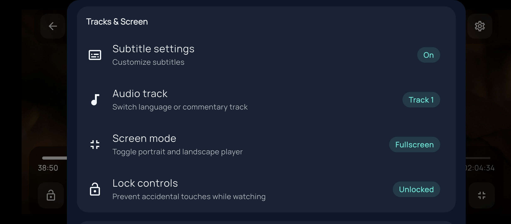
  
  <br />
  <br />

# 🎬 MPx Player

**The Ultimate Privacy-Focused Local Video Player for Android & iOS**

  <p align="center">
    <a href="https://flutter.dev/"></a>
    <a href="https://dart.dev/"></a>
    <a href="LICENSE"></a>
    
  </p>

  <p align="center">
    <b>Clean Architecture • Offline-First Design • Professional Code Quality • Zero Tracking • Zero Analytics</b>
  </p>

</div>

---

## 📱 Screenshots Showcase

<div align="center">
  <table>
    <tr>
      <td align="center"></td>
      <td align="center">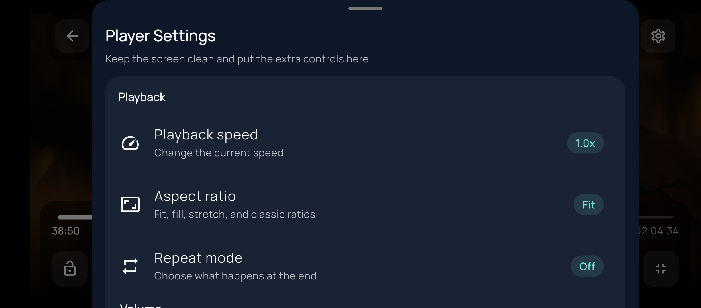</td>
      <td align="center">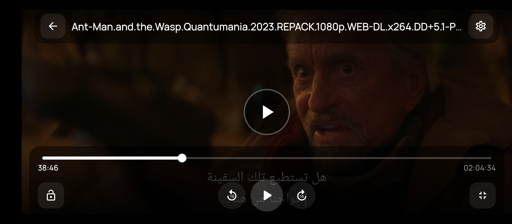</td>
      <td align="center">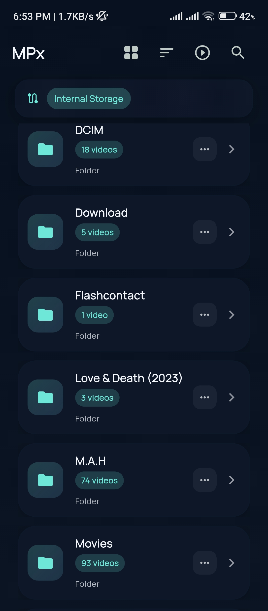</td>
    </tr>
    <tr>
      <td align="center">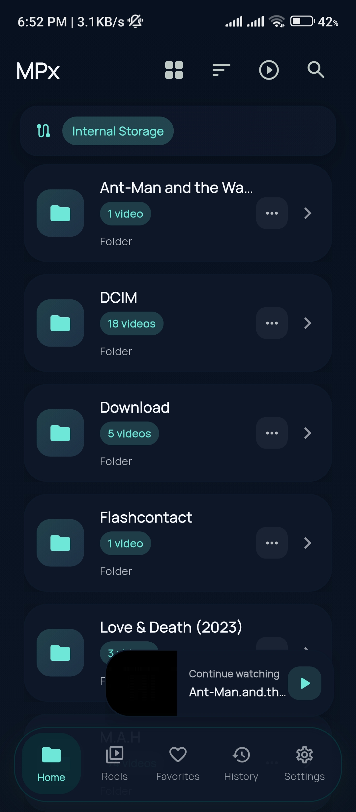</td>
      <td align="center">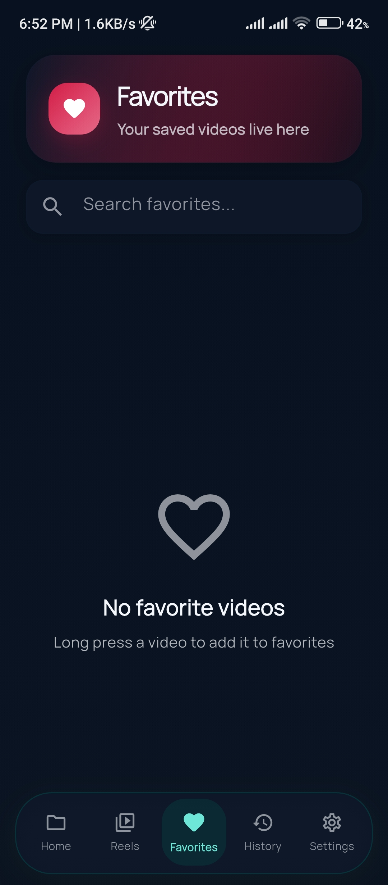</td>
      <td align="center">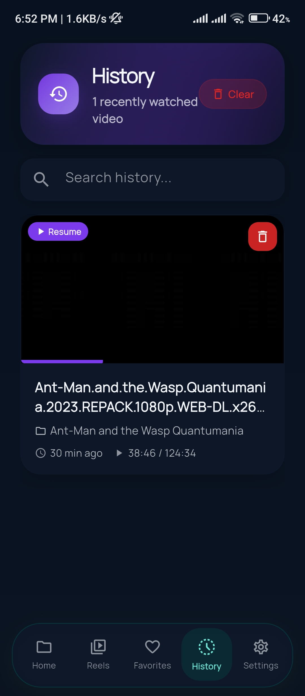</td>
      <td align="center">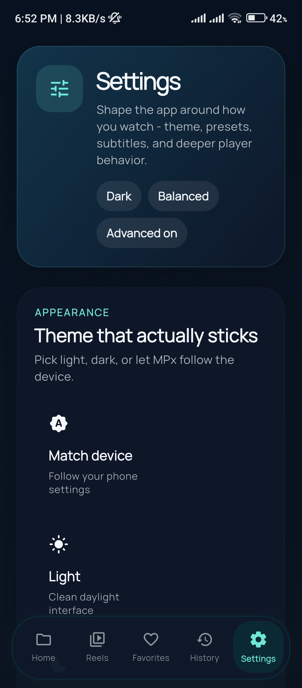</td>
    </tr>
    <tr>
      <td align="center">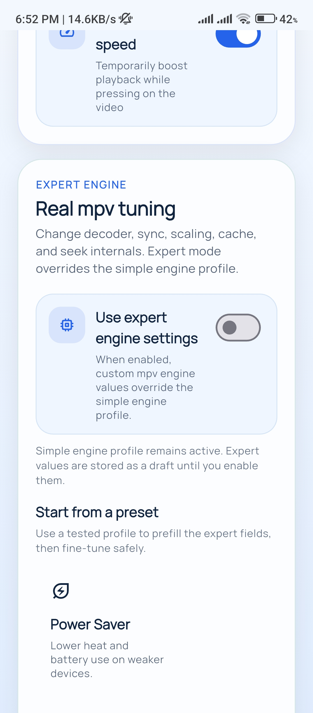</td>
      <td align="center">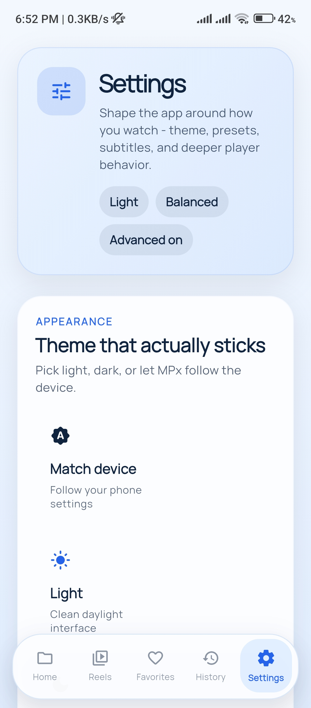</td>
      <td align="center">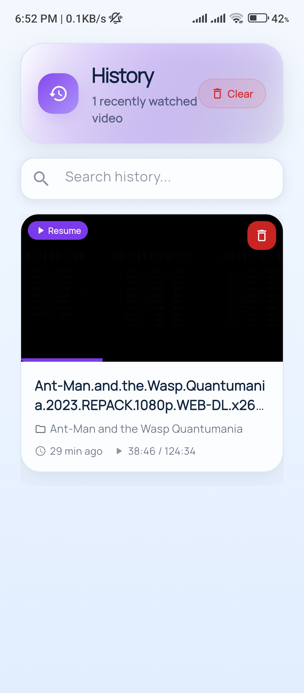</td>
      <td align="center">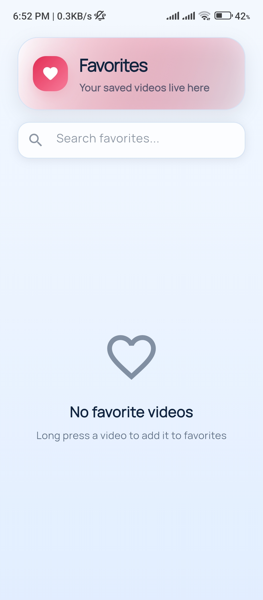</td>
    </tr>
    <tr>
      <td align="center" colspan="2">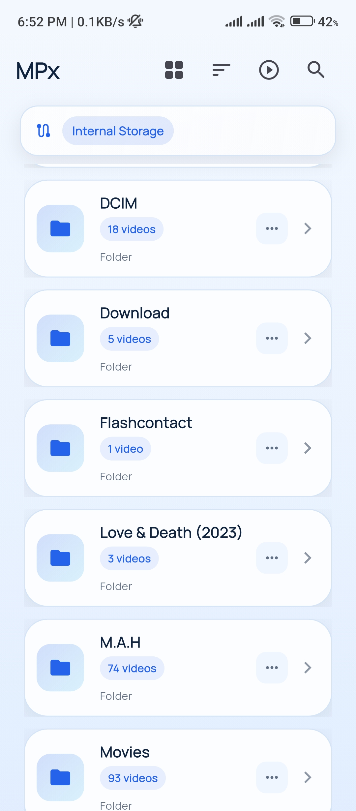</td>
      <td align="center" colspan="2">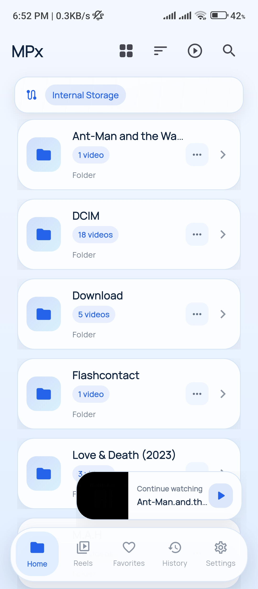</td>
    </tr>
  </table>
</div>

---

## 🌟 Why MPx Player?

MPx Player is not just another video player. It's built from the ground up prioritizing **your privacy** and delivering a **lightning-fast experience**.

We guarantee:

- 🚫 **No Analytics**
- 🚫 **No Tracking**
- 🚫 **No Internet Required**
- 🚫 **No Ads**

---

## ✨ Power-Packed Features

### 🏠 Intelligent Library Management

> Experience your media library without the wait.

- ⚡ **Instant Loading**: Persistent SQLite indexing means it scans once and loads instantly forever.
- 🧹 **Smart Filtering**: Automatically hides empty folders.
- 🗂️ **Folder-Based Organization**: Easily browse `Camera`, `Downloads`, `Movies`, and more.
- 🔍 **Instant Search**: Find any video across your entire indexed library in milliseconds.
- 🔄 **Pull-to-Refresh**: Seamlessly rescan storage and rebuild your index on demand.

### 🎬 Advanced Video Playback

> Powered by the robust `flutter_mpv` engine for uncompromising quality.

- 🚀 **Hardware Acceleration**: Deep tuning options for flawless playback.
- 🛠️ **Expert Engine Mode**: Override underlying decoding, sync, and frame-dropping strategies.
- 🤌 **Intuitive Gestures**:
  - ↔️ _Horizontal Swipe_: Seek forward/backward
  - ↕️ _Left Vertical Swipe_: Adjust Brightness
  - ↕️ _Right Vertical Swipe_: Adjust Volume
  - 👆 _Long Press_: 2x Speed playback
  - ✌️ _Double Tap_: Quick seeking & pause/play
- 📝 **Advanced Subtitles**: Full customization (size up to 72pt, colors, font types, background).
- 🕒 **Watch History**: Automatically remembers where you left off.

### ⭐ Favorites & Personalization

- ❤️ **One-Tap Favorites**: Curate your favorite videos with persistent SQLite storage.
- 🎨 **Modern Material 3**: Beautiful, fluid, and responsive design with smooth animations.
- ⚙️ **Deep Customization**: Control auto-resume, keep-awake behavior, cache management, and manual `mpv` parameters.

---

## 🏗️ Clean & Scalable Architecture

MPx Player is engineered with **Clean Architecture** principles and **Feature-Based** organization, making the codebase highly maintainable and scalable.

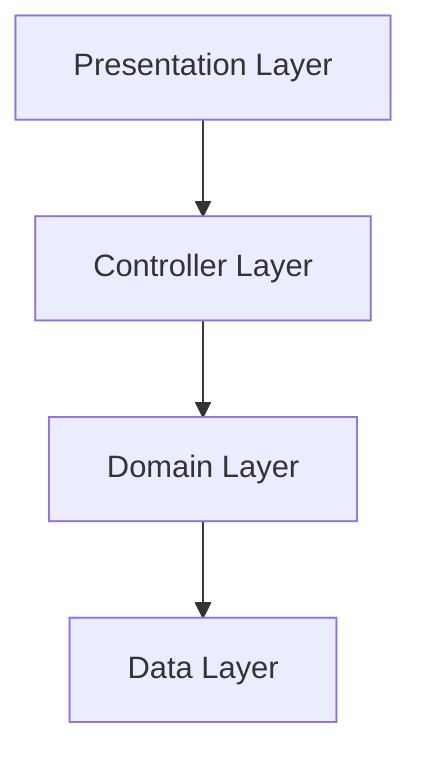

Explore our deep-dives:

- 📐 **[Architecture Overview](ARCHITECTURE.md)**
- 🤝 **[Contributing Guide](CONTRIBUTING.md)**

---

## 🛠️ Tech Stack

| Domain                     | Technologies                                             |
| -------------------------- | -------------------------------------------------------- |
| **Core Framework**         | Flutter 3.0+, Dart 3.0+                                  |
| **Video Engine**           | `flutter_mpv`, `flutter_mpv_video`                       |
| **State Management**       | Provider                                                 |
| **Database & Persistence** | `sqflite`, `shared_preferences`                          |
| **UI & Animations**        | Material 3, Google Fonts, `flutter_staggered_animations` |

---

## 🚀 Getting Started

Follow these steps to build the project locally.

### Prerequisites

- [Flutter SDK](https://flutter.dev/docs/get-started/install) 3.0.0 or higher
- Android Studio / Xcode
- Git

### Installation

1. **Clone the repository:**

   ```bash
   git clone https://github.com/mohammedbakri123/MPx-player.git
   cd MPx-player
   ```

2. **Install dependencies:**

   ```bash
   flutter pub get
   ```

3. **Run the app:**
   ```bash
   flutter run
   ```

---

## 🤝 Contributing

We welcome contributions from the community! Whether it's a bug fix, new feature, or UI polish, your help is appreciated.

Please check out our [**Contributing Guidelines**](CONTRIBUTING.md) to get started. Let's build the best local video player together!

---

## 📄 License

This project is licensed under the MIT License - see the [LICENSE](LICENSE) file for details.

<div align="center">
  <p>Made with ❤️ using Flutter | 100% Offline | Zero Tracking</p>
</div>
