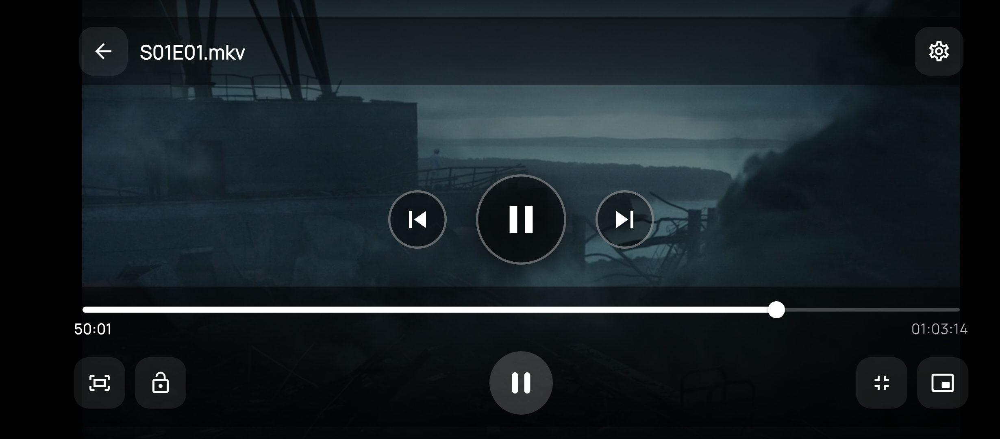
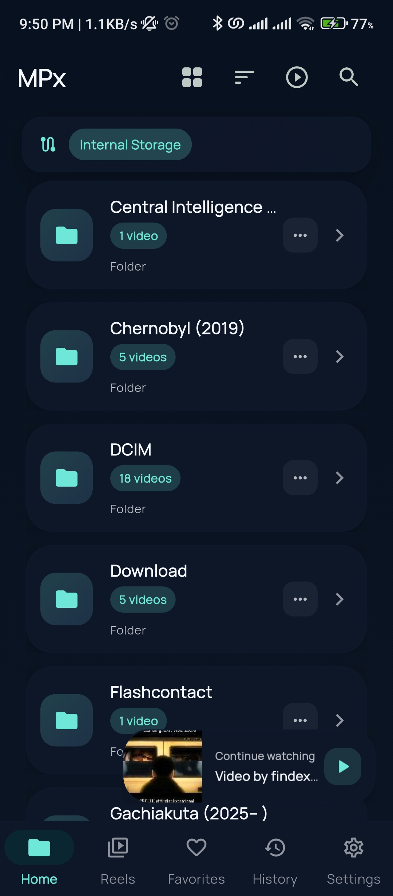
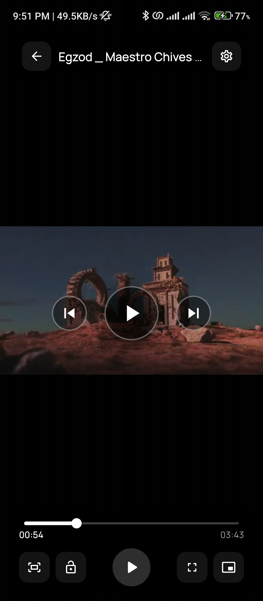
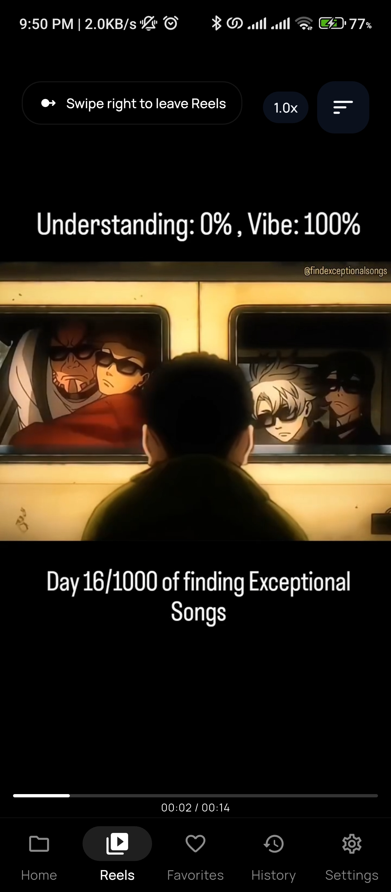
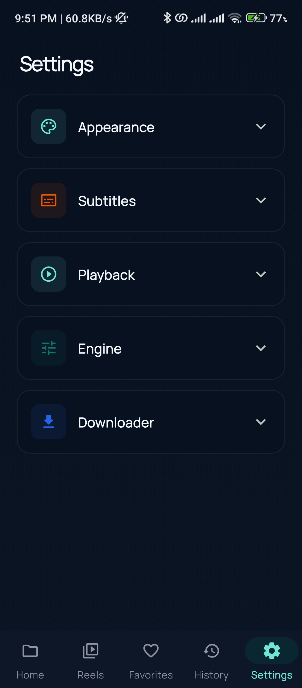

# MPx Player

<p align="center">
  
</p>

<p align="center">
  <strong>A privacy-first Flutter media player built for serious local playback.</strong>
</p>

<p align="center">
  MPx Player combines an <code>mpv</code>-powered playback core with a polished mobile interface,
  rich gesture controls, subtitle customization, downloader tooling, reels-style browsing,
  and a contributor-friendly architecture.
</p>

<p align="center">
  <a href="CONTRIBUTING.md">Contributing</a> ·
  <a href="ARCHITECTURE.md">Architecture</a> ·
  <a href="SECURITY.md">Security</a> ·
  <a href="LICENSE">License</a>
</p>

## The Pitch

Most media apps trade quality for convenience, or privacy for features.

MPx Player is built around a different idea: local media software should feel fast, powerful, and respectful. No ad network. No analytics pipeline. No attention traps. Just a capable player with real product depth and room to grow.

This is a project for users who care about control, and for contributors who want to work on something practical, performance-sensitive, and visible.

## Why MPx Player

- Private by default: no telemetry, no trackers, no ad SDKs
- Playback first: `mpv` engine, gesture controls, subtitles, audio track support, history, and tuning
- Product-minded: downloader support, library indexing, favorites, reels flow, PiP, and customization
- Built to evolve: feature-first structure and clear separation of responsibilities

## Core Features

### Playback Experience

- `mpv`-backed playback using `flutter_mpv`
- Double-tap seek with configurable seek step
- Horizontal drag scrubbing
- Long press for temporary `2x` playback
- Swipe brightness and volume controls
- Aspect ratio modes and expert playback tuning
- Watch history and resume behavior

### Subtitle and Audio Control

- External subtitle loading
- Subtitle font, size, weight, color, background, and placement controls
- Audio track selection with restore behavior

### Library and Organization

- Indexed local media library
- Folder browsing and search
- Favorites support
- Thumbnail and metadata extraction

### Downloader and Reels

- Downloader flow powered by Chaquopy and `yt-dlp`
- Share-target integration
- Reels-style short-form playback surface

## Product Principles

These principles shape both features and code review:

- Respect the user
- Keep local playback fast
- Prefer clarity over cleverness
- Avoid hidden behavior
- Build for long-term maintainability

## Screenshots

<p align="center">
  
  
  
  
</p>

## Tech Stack

- Flutter
- Dart
- `flutter_mpv`, `flutter_mpv_video`, `flutter_mpv_libs_video`
- `provider`
- `sqflite`
- `shared_preferences`
- Chaquopy + `yt-dlp`

## Project Structure

```text
lib/
  core/
  features/
    downloader/
    library/
    player/
    reels/
    settings/
```

For a deeper overview, read `ARCHITECTURE.md`.

## Getting Started

### Requirements

- Flutter SDK
- Android Studio and Android SDK
- Python 3 for Android builds using Chaquopy
- A real Android device is recommended for playback and gesture work

### Local Setup

```bash
git clone https://github.com/mohammedbakri123/MPx-player.git
cd MPx-player/mpx
flutter pub get
flutter analyze
flutter test
flutter run
```

### Android Release Build

The Android release flow is optimized for `arm64-v8a`:

```bash
flutter build apk --release --target-platform android-arm64
```

## Contribution Guide

Contributions are welcome across product, performance, UX, architecture, testing, and documentation.

High-impact areas include:

- playback reliability and responsiveness
- gesture quality and overlay behavior
- subtitle and audio handling
- downloader stability
- library search and indexing
- release engineering and APK size work
- contributor onboarding and docs

Start with `CONTRIBUTING.md`.

## Documentation Index

- `README.md`: product overview and onboarding
- `ARCHITECTURE.md`: system design and codebase map
- `CONTRIBUTING.md`: contributor workflow and expectations
- `SECURITY.md`: reporting and security policy
- `CHANGELOG.md`: release history
- `LICENSE`: legal terms for use and contribution

## License

This project is released under the MIT License. See `LICENSE`.

## Final Note

If you care about private, high-quality local media software, MPx Player is a strong place to contribute. The problems here are real, the impact is visible, and thoughtful work makes the app better immediately.
